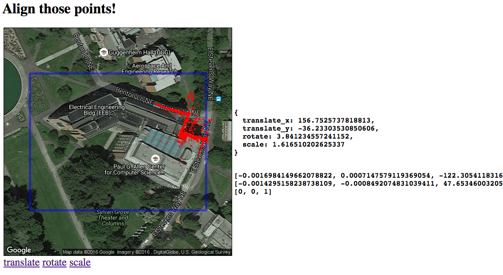

# HTML5 Bundle Aligner

Interactively align a bundle file point cloud to a satellite map. 

### Use it
Get your own Google Static Maps API key: https://developers.google.com/maps/documentation/static-maps/

Put that API key in the javascript at the top of `canvas.html`.

Run a local server `python -m SimpleHTTPServer` and visit `http://localhost:8000/canvas.html`

### Customize
Use `bundle2json.py` to transform a bundle file into json (just an array of `{x: #, y: #}` . This python script works on bundle file version 0.5 (created for PhotoCity) where the image path is included in the bundle file, each point/track has an extra line representing a player id, and the y axis is up (so look at the x and z coordinates for an overhead view). You'll probably need to modify this script or make your own for your own file format.

Choose bounds for the map image: 

    var topLat = 47.6539193340082;
    var leftLong = -122.3073148727417;
    var bottomLat = 47.65280636096129;
    var rightLong = -122.3051905632019;

Screenshot:

One of the photos used to make this point cloud:

### Notes
Uses the Javascript matrix library sylvester (http://sylvester.jcoglan.com/) to compute a matrix from translation, rotation, and scale. 
